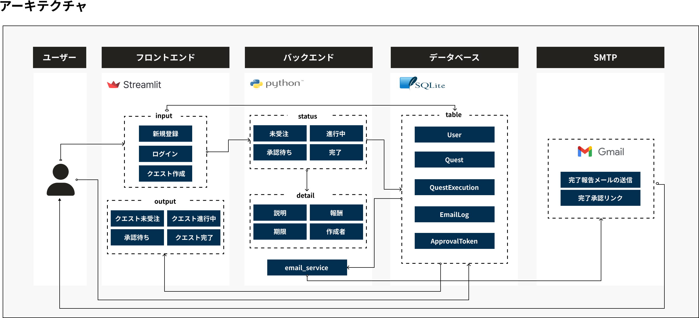
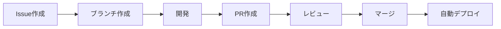

# チャリンジャー - お手伝いが冒険になる 🎮

<div align="center">
  
  
  **親子のコミュニケーションを「クエスト」で楽しく**
  
  [](https://fkyjucgnxndwmqsh5zzzsr.streamlit.app)
</div>

## 📖 プロダクト概要

**チャリンジャー**は、お手伝いをRPGのクエストに見立てた親子コミュニケーションアプリです。
子供のお手伝いへのモチベーション向上と、親子間のタスク管理を楽しくサポートします。

- 🚀 **デプロイURL**: https://fkyjucgnxndwmqsh5zzzsr.streamlit.app
- 📅 **プロジェクト期間**: 1ヶ月間（2025年8月31日〜9月29日）
- 👥 **チーム**: 3名（PdM、Lead Designer、Lead Engineer）

## 🤔 なぜ作ったか（WHY）

### 親の悩み
- 子供にお手伝いをしてもらいたいが、モチベーションが続かない
- お小遣いの適正価格がわからない
- タスク管理が煩雑

### 子供の課題  
- 努力と成果の関係が見えない
- 達成感を得る機会が少ない
- お手伝いが「義務」になってしまう

### 私たちの解決策
**お手伝いを「クエスト」として楽しく管理**することで、親子双方にメリットを提供します。

## ✨ 主要機能（WHAT）

### アーキテクチャ


### 実装済み機能

#### 1. ユーザー管理
- ✅ 新規登録
- ✅ ログイン/ログアウト
- ✅ セッション管理

#### 2. クエスト管理
- ✅ クエスト新規発行（タイトル、詳細、報酬、期限設定）
- ✅ カンバンボードでの進捗管理
- ✅ ステータス管理（未受注→進行中→承認待ち→完了）

#### 3. 承認フロー
- ✅ メール送信による承認依頼
- ✅ ワンクリック承認（メールリンクから）
- ✅ 承認後の自動ステータス更新

### デモ動画
[動画を見る](https://drive.google.com/file/d/1iU_dniYP-lakA0RgCPJw7CMMTgdj7b2C/view?usp=sharing)

## 🛠 技術構成（HOW）

### 技術スタック
| カテゴリ | 技術 | 選定理由 |
|---------|------|----------|
| フロントエンド | Streamlit | 短期間でのUI構築が可能 |
| バックエンド | Python | チーム全員が扱える言語 |
| データベース | SQLite | 軽量で導入が簡単 |
| メール送信 | Gmail SMTP | 無料で利用可能 |
| デプロイ | Streamlit Cloud | GitHubとの連携が簡単 |

### 技術的チャレンジと解決策
- **Streamlitのモーダル制約** → ポップアップUIを代替実装で対応
- **データ永続性の課題** → デモ版として割り切り、MVPに集中
- **メール承認の実装** → トークン生成とURL認証で実現

## 👥 チーム開発の成果

### 開発プロセス


### GitHub活用実績
- 📊 **GitHub Projects**: Epic → Issue → PRの階層管理
- 🌿 **ブランチ戦略**: feature/機能名での開発
- 🔒 **ブランチ保護**: mainブランチへの直接push禁止
- 👀 **コードレビュー**: 全PRに対してレビュー実施

### 定量的成果
| 項目 | 数値 |
|-----|------|
| 実装機能数 | 7機能 |
| Issue数 | 10件 |
| PR数 | 12件 |
| レビュー実施率 | 100% |
| コンフリクト発生 | 1件 |

## 📚 学びと振り返り

### しゅんすけ
#### 学び
- **Git/GitHub**: 全メンバーが実践的に習得
- **Source Tree**: GUIツールでの効率的な操作
- **コンフリクト回避**: 事前調整とこまめなプル

#### 振り返り
- **早期の方向転換**: 1週間前の現実的な判断が成功の鍵
- **ドキュメント整備**: コードより先にルール整備
- **進捗の可視化**: GitHub Projectsでの透明性確保

### りす
#### 学び
- **チーム開発ツール「Git/Github」の使い方全般**: ブランチ/チェックアウトの挙動の理解（ローカルに存在しないブランチは作成が必要）
- **Streamlitライブラリでできること、できないことの確認＋実装方法の検討**:ログイン認証やテキストボックスなどはライブラリを利用、CSSができない問題はインラインに埋め込む形式で切り替え
- **DBへの記録方法とデータの呼び出し**: 新しくテーブルへ登録する関数を作成して、データ記録/呼び出しのコードの学習

#### 振り返り
- 個人的な時間チームの時間が限られている中、最大限のパフォーマンスを行うためにAIや記事などを利用し作成
- チーム開発の経験の共同開発での学びを今回のプロダクトの目的にしていたため、自身で手を動かしてコードを書き、機能開発をする経験が出来てとてもよかった

### けんた
#### 学び
- **アーキテクチャ設計の事前共有の重要性**
- **技術選択における合意形成**
- **コード共有とレビュー体制の構築**

#### 振り返り
- チーム開発では技術的な実装スキルに加えて、設計の共有、意思決定の透明性、進捗の可視化が重要だった
- 特にGitHub Issueでの進捗管理とSource Treeを使った効率的なGit運用により、3人での協業を円滑に進められた	

## 🚀 今後の展望（Phase 2）

### 機能拡張計画
- 💳 決済API連携（PayPay等）
- 📊 データ分析機能（達成率、傾向分析）
- 🎮 ゲーミフィケーション強化（レベル、バッジ、実績）
- 📱 モバイル最適化

### 技術的改善
- PostgreSQL等のクラウドDBへの移行
- CI/CDパイプラインの構築
- テスト自動化

## 🏃‍♂️ ローカル実行方法

### 前提条件
- Python 3.8以上
- Git

### セットアップ
```bash
# リポジトリのクローン
git clone https://github.com/Shun0914/team1_3peace_ver2.0.git
cd team1_3peace_ver2.0

# 仮想環境の作成と有効化
python -m venv venv
source venv/bin/activate  # Windows: venv\Scripts\activate

# 依存パッケージのインストール
pip install -r requirements.txt

# 環境変数の設定
cp .env.example .env
# .envファイルを編集して必要な情報を設定

# アプリケーションの起動
streamlit run main.py
```

## 📝 ドキュメント

- [要件定義書](docs/requirements_definition.md)
- [Git/GitHub学習記録](../week14_web_application_third/git_github_learning_report.md)
- [PdM振り返りレポート](../week14_web_application_third/pdm_learning_report.md)

## 👨‍👩‍👧‍👦 チームメンバー

| 役割 | 名前 | 担当 |
|-----|------|------|
| PdM | しゅんすけ | プロジェクト管理、メインボード・メール機能実装 |
| Lead Designer | りす | UI/UX設計、基本機能実装 |
| Lead Engineer | けんた | DB設計、基盤実装 |

## 📄 ライセンス

このプロジェクトは学習目的で作成されました。

## 🙏 謝辞

Tech0プログラムの講師陣および運営チームの皆様、
1ヶ月という短期間でのチーム開発を支援いただき、ありがとうございました。

---

<div align="center">
  <strong>お手伝いが、冒険になる。</strong><br>
  チャリンジャーで、親子の新しいコミュニケーションを始めよう！
</div>
